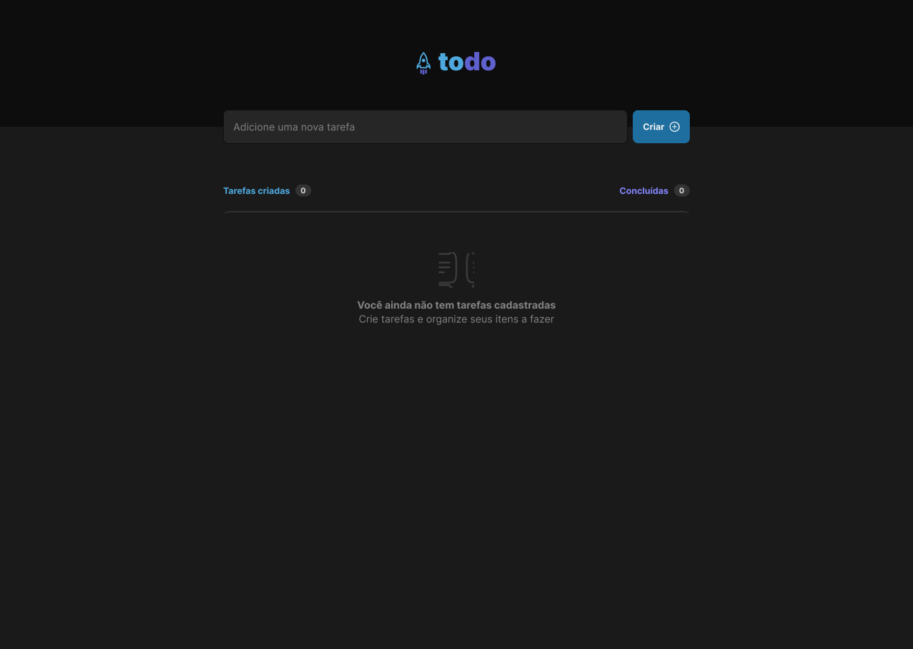
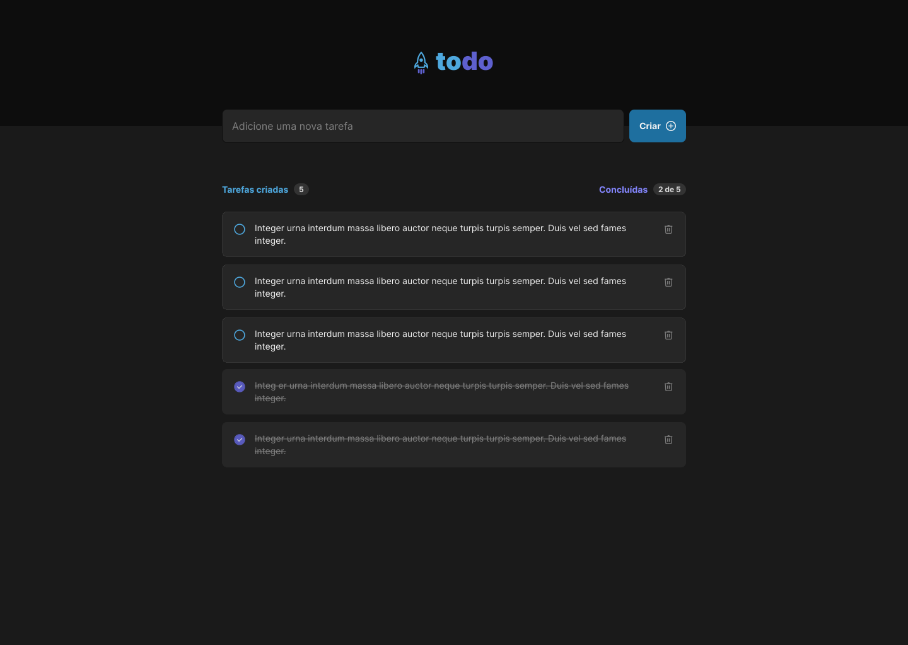

# To-do List project

  <a href="#-tecnologias">Technologies</a>&nbsp;&nbsp;&nbsp;|&nbsp;&nbsp;&nbsp;
  <a href="#-projeto">Projects</a>&nbsp;&nbsp;&nbsp;|&nbsp;&nbsp;&nbsp;
  <a href="#memo-licença">Lincense</a>

## 🚀 Technologies

This project was developed with the following technologies:

- JavaScript
- React
- TypeScript
- Html
- Css

## 💻 Project

This project was built to support the study of how to develop applications in react and its features. It is intended to apply concepts of components, properties, module css and CRUD task

## How to use?

1. Download this repository and with your terminal, enter the directory

2. Run `npm install OR yarn` to install the dependencies

3. And to start the application, run the command `npm start OR yarn start`

##

# Project vision

## Initial layout

 
 
 
 

## Add tasks in project

Made by Pedro Henrique Lima

